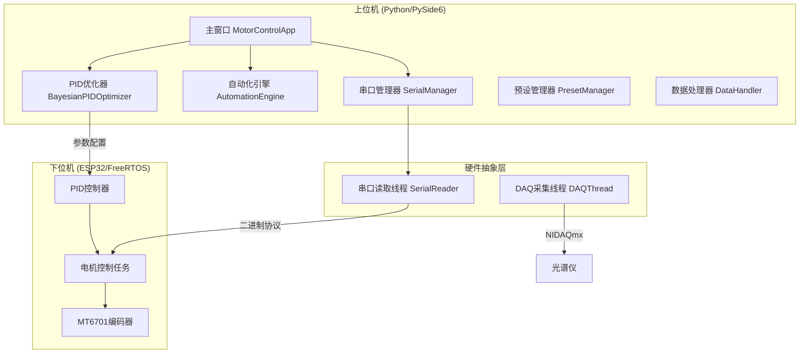

[English](./README_en.md) | [简体中文](./README.md)

# 环境现场监测系统控制程序


基于 PySide6 的多轴电机控制与光谱仪数据采集系统，支持 PID 闭环精确定位、贝叶斯参数自动优化及实时数据可视化。

---

## 系统架构



### 核心组件

| 模块 | 职责 |
|------|------|
| `SerialManager` | 串口连接管理、指令发送、Qt 信号驱动的异步数据接收 |
| `BayesianPIDOptimizer` | 高斯过程回归 + EI 采集函数的贝叶斯优化，支持非线性惩罚机制 |
| `AutomationThread` | 多步骤自动化流程执行，支持 PID 完成等待与高精度间隔计时 |
| `SerialReader` | 混合协议解析（文本 + 0xAA/0xBB/0xCC 二进制数据包） |
| `PresetManager` | 手动/自动预设的 JSON 持久化存储 |
| `DAQThread` | NIDAQmx 光谱仪电压采集线程 |

### 设计模式

- **Mixin 模式**: 主窗口通过多重继承组合功能模块（SerialMixin、AutomationMixin、PIDDataMixin 等）
- **信号槽机制**: Qt Signal/Slot 实现跨线程安全通信
- **状态机**: PID 优化器使用 `OptimizerState` 枚举管理生命周期
- **弱引用**: 自动化线程使用 `weakref` 避免循环引用

---

## 核心功能

### 电机控制
- 四轴独立控制（X/Y/Z/A），支持开环定角度/连续转动
- PID 闭环精确定位模式，可配置目标阈值（0.05°~2.0°）
- 实时角度监控与偏差分析图表

### PID 参数优化
- 贝叶斯优化算法（scikit-optimize），20-30 次迭代快速收敛
- 非线性惩罚机制：过冲超阈值时得分断崖式下跌
- 支持早停、动态边界收缩、状态保存/恢复

### 自动化流程
- 可视化步骤编辑器，支持拖拽排序
- 循环执行（有限/无限次）
- PID 模式下等待电机到位后再计时

### 光谱仪集成
- NIDAQmx 设备自动发现
- 可配置采样率的实时电压采集
- PyQtGraph 高性能波形显示

---

## 项目结构

```
├── main.py                 # 应用入口
├── requirements.txt        # 依赖清单
├── data/                   # 运行时数据
│   ├── presets.json        # 预设存储
│   └── settings.json       # 用户设置
├── src/
│   ├── config/             # 配置模块
│   │   ├── constants.py    # 全局常量与样式表
│   │   └── settings.py     # 设置管理器
│   ├── core/               # 核心业务逻辑
│   │   ├── serial_manager.py
│   │   ├── pid_optimizer.py
│   │   ├── automation_engine.py
│   │   └── preset_manager.py
│   ├── hardware/           # 硬件抽象
│   │   ├── serial_reader.py
│   │   └── daq_thread.py
│   ├── ui/                 # 界面组件
│   │   ├── main_window_complete.py
│   │   ├── mixins/         # 功能混入模块
│   │   ├── widgets/        # 自定义控件
│   │   └── dialogs/        # 对话框
│   └── utils/              # 工具类
└── lowerDevice/            # ESP32 下位机固件 (PlatformIO)
    └── src/main.cpp
```

---

## 安装与使用

### 环境要求
- Python 3.11+
- Windows 10/11（光谱仪功能需要 NI-DAQmx 驱动）

### 安装步骤

```bash
# 1. 创建虚拟环境
python -m venv .venv
.venv\Scripts\activate

# 2. 安装依赖
pip install -r requirements.txt

# 3. (可选) 安装 PID 优化依赖
pip install scikit-optimize

# 4. (可选) 安装光谱仪依赖
pip install nidaqmx pyqtgraph scipy
```

### 运行程序

```bash
python main.py
```

或使用启动脚本：

```bash
start.bat
```

### 配置说明

1. **串口连接**: 选择端口和波特率（默认 COM4 / 115200）
2. **PID 模式**: 开启后电机使用闭环定位，可调节目标阈值
3. **预设管理**: 手动/自动控制参数可保存为预设

---

## 通信协议

### 上位机指令格式

| 指令 | 格式 | 说明 |
|------|------|------|
| 电机控制 | `XEFV5J90.0\r\n` | X轴启用、正转、5RPM、90° |
| PID定位 | `XEFR45.0P0.5` | X轴正转45°，精度0.5° |
| PID配置 | `PIDCFG:0.14,0.015,0.06,1.0,8.0` | Kp,Ki,Kd,OutMin,OutMax |
| PID测试 | `PIDTEST:X,F,60.0,5` | X轴正转60°测试5次 |

### 下位机数据包

| 类型 | 帧头 | 大小 | 内容 |
|------|------|------|------|
| PID数据 | 0x55 0xAA | 29B | 时间戳、目标/实际角度、PID输出、误差 |
| 测试结果 | 0x55 0xBB | 18B | 收敛时间、过冲、振荡次数、综合评分 |
| 角度流 | 0x55 0xCC | 20B | 四轴实时角度 |

---

## 开发指南

### 代码风格
```bash
# 格式化
black src/ tests/

# 类型检查
mypy src/

# 代码检查
flake8 src/
```

### 运行测试
```bash
pytest tests/ -v
```
