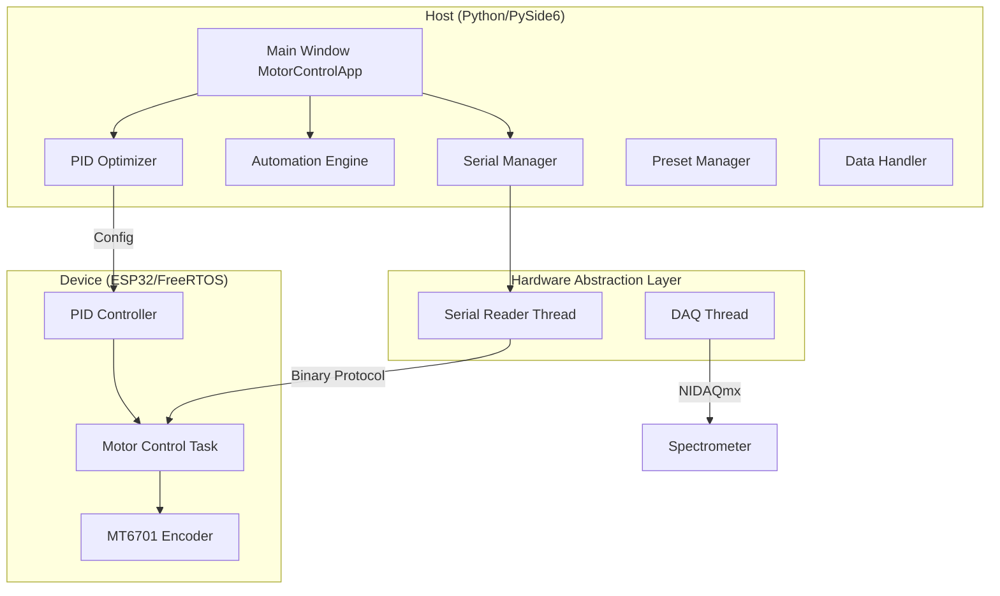

[English](./README_en.md) | [简体中文](./README.md)

# Environmental Field Monitoring System Controller


A PySide6-based multi-axis motor control and spectrometer data acquisition system featuring PID closed-loop positioning, Bayesian parameter auto-tuning, and real-time data visualization.

---

## System Architecture



### Core Components

| Module | Responsibility |
|--------|----------------|
| `SerialManager` | Serial connection management, command transmission, Qt signal-driven async data reception |
| `BayesianPIDOptimizer` | Gaussian Process Regression + EI acquisition function, nonlinear penalty mechanism |
| `AutomationThread` | Multi-step automation execution with PID completion wait and high-precision interval timing |
| `SerialReader` | Hybrid protocol parsing (text + 0xAA/0xBB/0xCC binary packets) |
| `PresetManager` | JSON persistence for manual/auto presets |
| `DAQThread` | NIDAQmx spectrometer voltage acquisition thread |

### Design Patterns

- **Mixin Pattern**: Main window composes functionality via multiple inheritance (SerialMixin, AutomationMixin, PIDDataMixin, etc.)
- **Signal-Slot**: Qt Signal/Slot for thread-safe cross-thread communication
- **State Machine**: PID optimizer uses `OptimizerState` enum for lifecycle management
- **Weak Reference**: Automation thread uses `weakref` to avoid circular references

---

## Key Features

### Motor Control
- Four-axis independent control (X/Y/Z/A), open-loop angle/continuous rotation
- PID closed-loop precise positioning with configurable threshold (0.05°~2.0°)
- Real-time angle monitoring and deviation analysis charts

### PID Parameter Optimization
- Bayesian optimization (scikit-optimize), converges in 20-30 iterations
- Nonlinear penalty: score drops sharply when overshoot exceeds threshold
- Early stopping, dynamic bound shrinking, state save/restore

### Automation Workflow
- Visual step editor with drag-and-drop sorting
- Loop execution (finite/infinite)
- PID mode waits for motor arrival before timing

### Spectrometer Integration
- NIDAQmx device auto-discovery
- Configurable sample rate real-time voltage acquisition
- PyQtGraph high-performance waveform display

---

## Project Structure

```
├── main.py                 # Application entry
├── requirements.txt        # Dependencies
├── data/                   # Runtime data
│   ├── presets.json        # Preset storage
│   └── settings.json       # User settings
├── src/
│   ├── config/             # Configuration
│   │   ├── constants.py    # Global constants & stylesheets
│   │   └── settings.py     # Settings manager
│   ├── core/               # Core business logic
│   │   ├── serial_manager.py
│   │   ├── pid_optimizer.py
│   │   ├── automation_engine.py
│   │   └── preset_manager.py
│   ├── hardware/           # Hardware abstraction
│   │   ├── serial_reader.py
│   │   └── daq_thread.py
│   ├── ui/                 # UI components
│   │   ├── main_window_complete.py
│   │   ├── mixins/         # Functionality mixins
│   │   ├── widgets/        # Custom widgets
│   │   └── dialogs/        # Dialogs
│   └── utils/              # Utilities
└── lowerDevice/            # ESP32 firmware (PlatformIO)
    └── src/main.cpp
```

---

## Installation & Usage

### Requirements
- Python 3.11+
- Windows 10/11 (NI-DAQmx driver required for spectrometer)

### Installation

```bash
# 1. Create virtual environment
python -m venv .venv
.venv\Scripts\activate

# 2. Install dependencies
pip install -r requirements.txt

# 3. (Optional) Install PID optimization dependencies
pip install scikit-optimize

# 4. (Optional) Install spectrometer dependencies
pip install nidaqmx pyqtgraph scipy
```

### Run

```bash
python main.py
```

Or use the startup script:

```bash
start.bat
```

### Configuration

1. **Serial Connection**: Select port and baudrate (default COM4 / 115200)
2. **PID Mode**: Enable for closed-loop positioning, adjustable target threshold
3. **Preset Management**: Save manual/auto control parameters as presets

---

## Communication Protocol

### Host Commands

| Command | Format | Description |
|---------|--------|-------------|
| Motor Control | `XEFV5J90.0\r\n` | X-axis enable, forward, 5RPM, 90° |
| PID Position | `XEFR45.0P0.5` | X-axis forward 45°, precision 0.5° |
| PID Config | `PIDCFG:0.14,0.015,0.06,1.0,8.0` | Kp,Ki,Kd,OutMin,OutMax |
| PID Test | `PIDTEST:X,F,60.0,5` | X-axis forward 60° test 5 runs |

### Device Packets

| Type | Header | Size | Content |
|------|--------|------|---------|
| PID Data | 0x55 0xAA | 29B | Timestamp, target/actual angle, PID output, error |
| Test Result | 0x55 0xBB | 18B | Convergence time, overshoot, oscillation count, total score |
| Angle Stream | 0x55 0xCC | 20B | Four-axis real-time angles |

---

## Development

### Code Style
```bash
# Format
black src/ tests/

# Type check
mypy src/

# Lint
flake8 src/
```

### Run Tests
```bash
pytest tests/ -v
```
